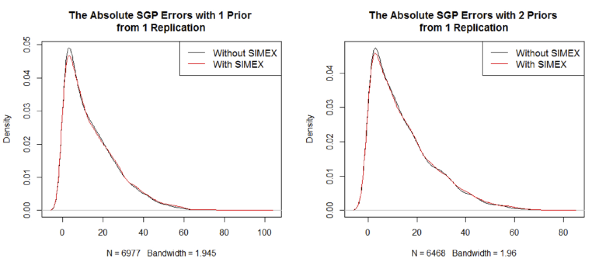
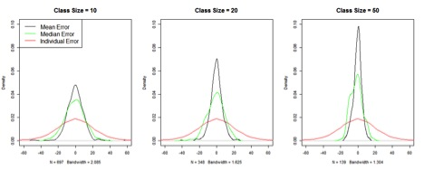
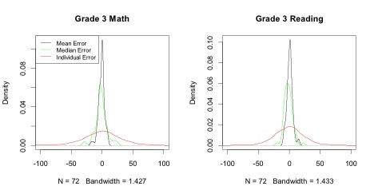

# The Effect of the SIMEX Method on Individual SGPs 

## The Set-up of the Simulation Study
We tested the performance of the SIMEX method with the SGP model in the following steps. We took scale scores of a cohort of students who were in grades 3-5 in years 2010-11 through 2012-13, and another cohort of students who were in grades 3-4 in years 2011-12 to 2012-13 in sgpData of the SGP package. We pretended that these are the true scores of the given grades and years. This dataset includes 6,468 students in the first cohort, and 6,977 students in the second cohort (missing values were excluded). We generated normally distributed measurement errors with the conditional standard errors of measurement of the various grades provided in SGPstateData in the same package. The "observed" scores are the sum of the "true" scores and the generated measurement errors. We ran the SGP analysis on the "true" scores and the SGP with SIMEX analysis on the "observed" scores respectively to produce "true" SGPs, "observed" SGPs, and SIMEX SGPs. To minimize sampling errors, 100 "observed" data sets were generated using the above method. As results, each student has a true SGP, 100 observed SGPs from the 100 generated data sets, and 100 SIMEX SGPs from the same data sets. 

## Quantifying the Performance of the SIMEX Method 

Bias and Mean Square Error (MSE) are the usual ways of quantifying the performance of statistical methods. In a simulation study where the major outcome is the estimation of a few model parameters, both are usually straight forward to calculate—bias is the difference between the estimated and the true parameter averaged over simulation replications, and MSE is the squared difference between the estimated and the true parameter averaged over simulation replications. 

In the simulation study of the SGP analysis, however, each replication of the analysis produces results for at least thousands of students. To evaluate the estimators, we need to summarize both across students and across replications. 

We derive the following statistics to compare SGPs estimated with and without SIMEX.

$$ \textit{Total MSE} = \frac{1}{n} \sum_ {i=1}^n \frac{1}{R} \sum_ {r=1}^R (\widehat{SGP}_ {i,r} - SGP_i)^2$$

Where $i=1, 2,\text{ ... },n$ indicates students, $r=1, 2,\text{ ... },R$ indicates simulation replications, $\widehat{SGP}_{i,r}$ denotes the estimated SGP (either with or without SIMEX) for student $\textit{i}$ in replication $\textit{r}$, and $SGP_i$ denotes the "true" SGP for student $\textit{i}$.

$$ \textit{Mean Bias} = \frac{1}{n} \sum_ {i=1}^n \frac{1}{R} \sum_ {r=1}^R (\widehat{SGP}_ {i,r} - SGP_i)$$

$$ \textit{SD Bias = Standard Deviation}_ {\textit{ across }i} (\frac{1}{R} \sum_ {r=1}^R \widehat{SGP}_ {i,r} - SGP_i)$$

*Total MSE* is a comprehensive standard which accounts for both bias and variability. *Mean Bias* is the bias averaged over students and replications, but since *Mean Bias* of either estimator is likely to be very close to 0, we also calculated *SD Bias*, which is derived by taking the difference between the estimated and the true SGPs averaged across replications, and then calculate the standard deviation of these differences across students. *SD Bias* may be a better indicator of the magnitude of bias than *Mean Bias*, just like Standard Error of Measurement is a better indicator of the magnitude of measurement errors than the mean, which is usually 0.

## Results 
The following table presents the results of the simulation study.

<!--
|----------------------+-------------+-------------+-------------+-------------+---------------+-------------|
|**Table 1.**          |             |             |             |             |              |              |
|                      |             | SGP Without SIMEX |       |             |              |SGP With SIMEX|
|:---------------------|------------:|------------:|------------:|------------:|--------------:|------------:|
|                      |...............|............................|...............|      |       |         |
|                      | Total MSE   |  Mean Bias  |   SD Bias   |  Total MSE  |   Mean Bias   |   SD Bias   |
| Grade 4 ~ Grade 3    |   362.980   |    0.019    |    8.004    |   393.244   |     -0.107    |    6.612    |
| Grade 5 ~ Grade 4, 3 |   360.795   |   -0.001    |    7.512    |   379.277   |      0.088    |    6.602    |
|----------------------+-------------+-------------+-------------+-------------+---------------+-------------|
-->

**Table 1.**

<table class='gmisc_table' style='border-collapse: collapse;'>
	
	<thead>
	<tr>
		<th style='font-weight: 900; border-top: 4px double grey;'></th>
		<th align='center' colspan='3' style='font-weight: 900; border-bottom: 1px solid grey; border-top: 4px double grey;'>SGP Without SIMEX</th><th style='border-top: 4px double grey;'>&nbsp;</th>
		<th align='center' colspan='3' style='font-weight: 900; border-bottom: 1px solid grey; border-top: 4px double grey;'>SGP With SIMEX</th>
	</tr>
	<tr>
		<th style=';'>&nbsp;</th>
		<th align='center' style='border-bottom: 1px solid grey;'>Total MSE</th>
		<th align='center' style='border-bottom: 1px solid grey;'>Mean Bias</th>
		<th align='center' style='border-bottom: 1px solid grey;'>SD Bias</th>
		<th style='border-bottom: 1px solid grey;'>&nbsp;</th>
		<th align='center' style='border-bottom: 1px solid grey;'>Total MSE</th>
		<th align='center' style='border-bottom: 1px solid grey;'>Mean Bias</th>
		<th align='center' style='border-bottom: 1px solid grey;'>SD Bias</th>
	</tr>
	</thead><tbody>
	<tr><td align='left' style='border-bottom: 1px solid grey; font-weight: 900;'>Analysis</td></tr>
	<tr>
		<td align='right' style=';'>Grade 4 | Grade 3</td>
		<td align='right' style=';'>362.98</td>
		<td align='right' style=';'> 0.02</td>
		<td align='right' style=';'> 8.00</td>
		<th style=';'>&nbsp;</th>
		<td align='right' style=';'>393.24</td>
		<td align='right' style=';'>-0.11</td>
		<td align='right' style=';'> 6.61</td>
	</tr>
	<tr>
		<td align='right' style='border-bottom: 1px solid grey;'>&nbsp;&nbsp;Grade 5 | Grade 4, 3</td>
		<td align='right' style='border-bottom: 1px solid grey;'>360.80</td>
		<td align='right' style='border-bottom: 1px solid grey;'>-0.00</td>
		<td align='right' style='border-bottom: 1px solid grey;'> 7.51</td>
		<th style='border-bottom: 1px solid grey;'>&nbsp;</th>
		<td align='right' style='border-bottom: 1px solid grey;'>379.28</td>
		<td align='right' style='border-bottom: 1px solid grey;'> 0.09</td>
		<td align='right' style='border-bottom: 1px solid grey;'> 6.60</td>
	</tr>
	</tbody>
</table>

### *Why Are the Total MSEs So Large?*
The first thing we notice is that the total MSEs are all very large. The square roots of the MSEs, generally considered a measure of the average magnitude of errors, are around 60, far greater than the *Mean Bias* or the *SD Bias*. 
To investigate this, we plot, in Figure 1, the density of the absolute values of the SGP (with and without SIMEX) errors with 1 and 2 prior year scores respectively from a single replication of the simulation study. Plots of other replications are highly similar. Figure 1 shows that, in any given replication of the simulation study, the absolute differences between estimated and true SGPs are highly skewed with a thin but long tail to the right. A small number of the errors in SGPs estimated with 1 prior are close to 100. Among SGPs estimated with 2 priors, it seems that there are less extreme outliers. SGPs estimated with SIMEX seem to mirror those without SIMEX closely, although the former tend to have more very large errors. The relatively small number of outliers can have dramatic influence on the MSE because, when squared, they become much larger and the skewness of the distributions of the squared errors will dramatically increase compared with those in Figure 1.

*Figure 1.*

### *Comparing the SIMEX Results with the Non-SIMEX Results*
Due to the skewness discussed in 1.3.1., the root mean square error is not a good measure of the magnitude of errors in this context. We compare the results of the SGP analysis with and without SIMEX based on two criteria—*SD Bias* and *MSE*. The comparison is straightforward: the SIMEX results have smaller biases but larger MSEs which indicates larger variability across replications. And it seems that in both scenarios (i.e. with 1 and 2 priors) the increase of variability outweighs the reduction of bias.
There is, however, something strange here. In earlier studies of the SIMEX method for correcting biased model coefficients, we noticed much bigger bias reductions than those presented in Table 1. The SIMEX estimators do generally have larger variabilities, but usually this drawback is outweighed by the prominent gains in bias reduction. Why is the SIMEX method not doing well this time?

### *Why Doesn’t the SIMEX Method Perform Well in Correcting Individual SGP?*
At the end of the measurement error report presented at the TAC Meeting in July, 2012, we raised the question about the validity of using the SIMEX method to correct individual level SGPs. The rationale is as follows. 
Suppose we estimated this model $\hat{y}_ {GOOD}=a+bx_ {OBSERVED}$ where $x_ {OBSERVED}$ is measured with errors, but what we really want to estimate is $\hat{y}_ {BETTER}=\alpha+\beta x_ {TRUE}$. Now the SIMEX method, or any other measurement error correction, moves us from a and b closer to $\alpha$ and $\beta$, and often times the goal is achieved at this stage. But in the SGP analysis, simply obtaining $\alpha$ and $\beta$ is not enough. To get more accurate SGPs, we need to obtain $\hat{y}_ {BETTER}$, which is not obtainable unless we have $x_ {TRUE}$. 
So, when estimating individual SGPs with SIMEX, what we estimated is roughly $\alpha+\beta x_ {TRUE}$, which is neither $\hat{y}_ {GOOD}$ nor $\hat{y}_ {BETTER}$. We were able to achieve some bias reduction, because the observed scores are usually not far from the true scores, but the effect is much discounted.
To test this theory, we plugged the "true" scores into the SIMEX process. Table 2 presents the outcomes of SGP without SIMEX and with SIMEX combined with "true" scores from 100 simulation replications.

<!--
|----------------------+-------------+-------------+-------------+-------------+---------------+-------------|
|**Table 2.**          |             |             |             |             |             | SGP With SIMEX|
|                      |             | SGP Without SIMEX |       |             |           | and "True" Score|
|:---------------------|------------:|------------:|------------:|------------:|--------------:|------------:|
|                      |...............|............................|...............|      |       |         |
|                      | Total MSE   |  Mean Bias  |   SD Bias   |  Total MSE  |   Mean Bias   |   SD Bias   |
| Grade 4 ~ Grade 3    |   362.980   |    0.019    |     8.004   |   248.836   |     -0.428    |     5.652   |
| Grade 5 ~ Grade 4, 3 |   360.795   |   -0.001    |     7.512   |   287.078   |     -0.057    |     6.225   |
|----------------------+-------------+-------------+-------------+-------------+---------------+-------------|
-->

**Table 2.**

<table class='gmisc_table' style='border-collapse: collapse;'>
	
	<thead>
	<tr>
		<th style='font-weight: 900; border-top: 4px double grey;'></th>
		<th align='center' colspan='3' style='font-weight: 900; border-bottom: 1px solid grey; border-top: 4px double grey;'>SGP Without SIMEX</th><th style='border-top: 4px double grey;'>&nbsp;</th>
		<th align='center' colspan='3' style='font-weight: 900; border-bottom: 1px solid grey; border-top: 4px double grey;'>SGP With SIMEX and "True" Score</th>
	</tr>
	<tr>
		<th style=';'>&nbsp;</th>
		<th align='center' style='border-bottom: 1px solid grey;'>Total MSE</th>
		<th align='center' style='border-bottom: 1px solid grey;'>Mean Bias</th>
		<th align='center' style='border-bottom: 1px solid grey;'>SD Bias</th>
		<th style='border-bottom: 1px solid grey;'>&nbsp;</th>
		<th align='center' style='border-bottom: 1px solid grey;'>Total MSE</th>
		<th align='center' style='border-bottom: 1px solid grey;'>Mean Bias</th>
		<th align='center' style='border-bottom: 1px solid grey;'>SD Bias</th>
	</tr>
	</thead><tbody>
	<tr><td align='left' style='border-bottom: 1px solid grey; font-weight: 900;'>Analysis</td></tr>
	<tr>
		<td align='right' style=';'>Grade 4 | Grade 3</td>
		<td align='right' style=';'>362.98</td>
		<td align='right' style=';'> 0.02</td>
		<td align='right' style=';'> 8.00</td>
		<th style=';'>&nbsp;</th>
		<td align='right' style=';'>287.78</td>
		<td align='right' style=';'>-0.428</td>
		<td align='right' style=';'> 5.65</td>
	</tr>
	<tr>
		<td align='right' style='border-bottom: 1px solid grey;'>&nbsp;&nbsp;Grade 5 | Grade 4, 3</td>
		<td align='right' style='border-bottom: 1px solid grey;'>360.80</td>
		<td align='right' style='border-bottom: 1px solid grey;'>-0.00</td>
		<td align='right' style='border-bottom: 1px solid grey;'> 7.51</td>
		<th style='border-bottom: 1px solid grey;'>&nbsp;</th>
		<td align='right' style='border-bottom: 1px solid grey;'>379.28</td>
		<td align='right' style='border-bottom: 1px solid grey;'>-0.57</td>
		<td align='right' style='border-bottom: 1px solid grey;'> 6.23</td>
	</tr>
	</tbody>
</table>

In Table 2, the SIMEX method greatly reduces both bias and MSE when used in combination with true scores. This shows that the fundamental reason for increased MSE in Table 1 is the use of SIMEX in combination with observed scores.

### *Can We Use Estimated True Scores?*
Results in Table 2 are obviously not obtainable in reality. As per some TAC members’ suggestion, we tried plugging in the estimated true scores:
$X_ {\text{Est. True}}= \text{Reliability} \times (X_ {OBSERVED}-\bar{X}_ {OBSERVED})+\bar{X}_ {OBSERVED}$
The results we obtained are almost exactly the same as those in Table 1, which suggests that the inaccessibility of the true scores is a problem that is insurmountable.

### *Conclusion*
Our conclusion is that the SIMEX method should not be used to correct individual SGPs. Indeed, we do not believe that any measure error correction method should be used to estimate individual outcomes or make predictions. 

# The Effect of the SIMEX Method on MGPs at the Class or School Level 
Although we concluded that the SIMEX method should not be used to estimate individual SGPs, we do believe that the SIMEX method can be useful to correct MGPs. This is because, collectively, the mean/median prior scores of a class/school should be close enough to the true mean/median prior scores that we can consider the problem in 1.3.3 at least partially solved.
To test the hypothesis that the differences between aggregated observed scores and the aggregated true scores are much smaller than the errors of the individual observed scores, we examined two scenarios—randomly assigned classes/schools and actual classes/schools which may involve sorting.

## Errors of Aggregated Scale Scores in Randomly Assigned Classes/Schools 
The nice thing about studying randomly assigned classes/schools, although this scenario may not be completely realistic, is that it allows us to isolate the influence of class/school size on errors. 
In the simulation described in 1.1, we randomly sampled without replacement students into classes of various sizes. We calculated the difference between class mean observed scores and class mean true scores, the difference between class median observed and true scores, and the difference between individual observed and true scores. Figure 2 plots the errors at different levels for Grade 3 scores with class sizes of 10, 20, and 50. The data are drawn from a single replication of the simulation study. Plots of other grades and other replications look highly similar.

*Figure 2.*

Figure 2 shows that, when observed scores are aggregated, even in classes of just 10 students, the magnitudes of errors are greatly reduced. The error reduction improves considerably as class/school sizes go up.

## Errors of Aggregated Scale Scores in Actual Classes/Schools 
We used sgpData_LONG contained in the SGP R package as our “true” data, and perturbed this dataset in the same way as we described in 1.1. This dataset contains school numbers. We calculated the errors of the school mean, school median, and individual scale scores. Figure 3 plots the errors of the Math and Reading scores obtained in one of the simulation replications in the third grade in 2012-13, which include 4,792 students in 72 schools. The error density plots of other subject matter, other grades and years, and other simulation replications look highly similar.

*Figure 3.*

Figure 3 shows that in actual schools which may involve student sorting, aggregated observed and true scores are again much closer to each other compared with individual observed and true scores. This confirms our theoretical basis for using SIMEX to correct aggregated SGPs.

## Using the SIMEX Method to Correct Median/Mean SGPs 
There are two possible ways to implement SIMEX on aggregated SGPs. The first way is to estimate individual SIMEX SGPs and then aggregate them at the class/school level. The second way is to apply the simulation-extrapolation process directly to MGPs—perturb the data to obtain more and more biased MGPs and then extrapolate the trend back to no errors. We examine each of them.

###  *SIMEX, then Aggregate*
We set up the simulation study similarly as that described in 1.1, except that this simulation is based on a different data set—sgpData_LONG, which contains school numbers. We calculated the total MSE, the Mean Bias, and the SD Bias, defined similarly as in equations (1), (2), and (3). The total MSE is the squared difference between estimated and “true” MGPs averaged across schools and replications; the Mean Bias is the difference between estimated and “true” MGPs averaged across schools and replications; and the SD Bias is the standard deviation across schools of the difference between estimated and “true” MGPs averaged across 100 replications. Results from the Reading test in Grades 4 and 5 conditioning on 1 and 2 priors respectively are presented in Table 3.

<!--
|----------------------+-------------+-------------+-------------+-------------+-------------+-------------|
|**Table 3.**          |             |             |             |             |             |             |
|                      |         | Mean School SGP |             |             |       | Median School SGP |
|:---------------------|------------:|------------:|:------------|------------:|------------:|------------:|
|                      |...............|.......................|...............|       |     |             |
|                      | Total MSE   |  Mean Bias  |   SD Bias   |  Total MSE  |  Mean Bias  |   SD Bias   |
|                      |             |             |             |             |             |             |
| Grade 4 ~ Grade 3
| Without SIMEX        |    5.574    |    -0.196   |    2.360    |   26.366    |   -0.104    |    5.137    |
| With SIMEX           |    4.741    |    -0.075   |    2.177    |   28.364    |    0.034    |    5.329    |
|===
|                      |             |             |             |             |             |             |
| Grade 5 ~ Grade 4, 3
| Without SIMEX        |    5.948    |    -0.263    |   2.433    |   27.101    |   -0.266    |    5.199    |
| With SIMEX           |    4.519    |     0.094    |   2.125    |   25.679    |    0.084    |    5.060    |
|----------------------+-------------+-------------+-------------+-------------+---------------+-----------|
-->

**Table 3.** 

<table class='gmisc_table' style='border-collapse: collapse;'>
	
	<thead>
	<tr>
		<th style='font-weight: 900; border-top: 4px double grey;'></th>
		<th align='center' colspan='3' style='font-weight: 900; border-bottom: 1px solid grey; border-top: 4px double grey;'>Man School SGP</th><th style='border-top: 4px double grey;'>&nbsp;</th>
		<th align='center' colspan='3' style='font-weight: 900; border-bottom: 1px solid grey; border-top: 4px double grey;'>Median School SGP</th>
	</tr>
	<tr>
		<th style=';'>&nbsp;</th>
		<th align='center' style='border-bottom: 1px solid grey;'>Total MSE</th>
		<th align='center' style='border-bottom: 1px solid grey;'>Mean Bias</th>
		<th align='center' style='border-bottom: 1px solid grey;'>SD Bias</th>
		<th style='border-bottom: 1px solid grey;'>&nbsp;</th>
		<th align='center' style='border-bottom: 1px solid grey;'>Total MSE</th>
		<th align='center' style='border-bottom: 1px solid grey;'>Mean Bias</th>
		<th align='center' style='border-bottom: 1px solid grey;'>SD Bias</th>
	</tr>
	</thead><tbody>
	<tr><td align='left' style='border-bottom: 1px solid grey; font-weight: 900;'>Grade 4 | Grade 3</td></tr>
	<tr>
		<td align='right' style=';'>Without SIMEX </td>
		<td align='right' style=';'>5.57</td>
		<td align='right' style=';'> -0.20</td>
		<td align='right' style=';'> 2.36</td>
		<th style=';'>&nbsp;</th>
		<td align='right' style=';'>26.37</td>
		<td align='right' style=';'>-0.10</td>
		<td align='right' style=';'> 5.14</td>
	</tr>
	<tr>
		<td align='right' style=';'>With SIMEX </td>
		<td align='right' style=';'>4.74</td>
		<td align='right' style=';'>-0.08</td>
		<td align='right' style=';'> 2.18</td>
		<th style=';'>&nbsp;</th>
		<td align='right' style=';'>28.36</td>
		<td align='right' style=';'> 0.03</td>
		<td align='right' style=';'> 5.33</td>
	</tr>
	<tr><td align='left' style='border-bottom: 1px solid grey; font-weight: 900;'>Grade 5 | Grade 4, 3</td></tr>
	<tr>
		<td align='right' style=';'>Without SIMEX </td>
		<td align='right' style=';'>5.95</td>
		<td align='right' style=';'>-0.26</td>
		<td align='right' style=';'> 2.43</td>
		<th style=';'>&nbsp;</th>
		<td align='right' style=';'>27.10</td>
		<td align='right' style=';'>-0.27</td>
		<td align='right' style=';'> 5.20</td>
	</tr>
	<tr>
		<td align='right' style=';'>With SIMEX </td>   4.519    |     0.094    |   2.125    |   25.679    |    0.084    |    5.060 
		<td align='right' style=';'>4.52</td>
		<td align='right' style=';'> 0.09</td>
		<td align='right' style=';'> 2.13</td>
		<th style=';'>&nbsp;</th>
		<td align='right' style=';'>25.68</td>
		<td align='right' style=';'> 0.08</td>
		<td align='right' style=';'> 5.06</td>
	</tr>
	</tbody>
</table>

